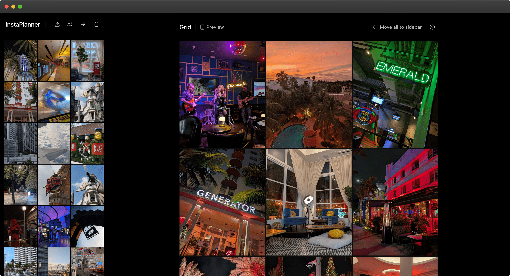
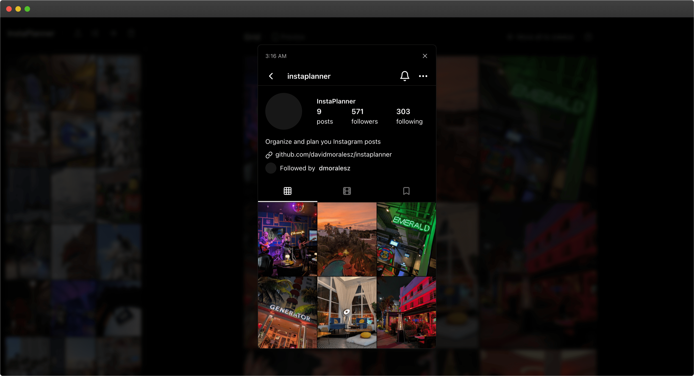

# InstaPlanner 

InstaPlanner is a modern, responsive web app for organizing and planning Instagram posts. It features an intuitive drag-and-drop interface, keyboard shortcuts, and a flexible layout system for efficient content management. The app is designed to help you visualize Instagram posts in a grid layout and manage them with ease.



## New Features

**Mobile Preview Dialog**: I introduced a `mobile-preview-dialog.tsx` component that offers a visual representation of how your Instagram posts will look on a mobile device. This dialog mimics the Instagram mobile interface for preview purposes, helping designers and marketers visualize content layout without interaction logic.



## Features

- **Drag-and-Drop:** Easily organize your media with intuitive drag-and-drop functionality.
- **Mobile Preview:** Visualize your content as it would appear on an Instagram profile with the new mobile preview dialog component.
- **Keyboard Shortcuts:** For power users to navigate and perform actions faster.
- **Local Storage with IndexedDB:** For persistent, secure storage.
- **Performance Focused:** Fast and efficient for large-scale post planning.
- **Built with TypeScript:** Providing type safety for better developer experience.

## Tech Stack

- **Frontend**: Next.js 14, TypeScript, Tailwind CSS, shadcn/ui, Framer Motion, dnd-kit
- **Testing**: Vitest, React Testing Library
- **Storage**: IndexedDB

## Getting Started

### Prerequisites

Ensure that you have the following installed:

- Node.js 18.18.0 or higher
- npm

### Installation

1. Clone the repository:

   ```bash
   git clone https://github.com/davidmoralesz/instaplanner.git
   cd instaplanner
   ```

2. Install dependencies:

   ```bash
   npm install
   ```

3. Run the development server:

   ```bash
   npm run dev
   ```

Your app will be live at [http://localhost:3000](http://localhost:3000).

## License

This project is licensed under the MIT License - see the [LICENSE](LICENSE) file for details.
