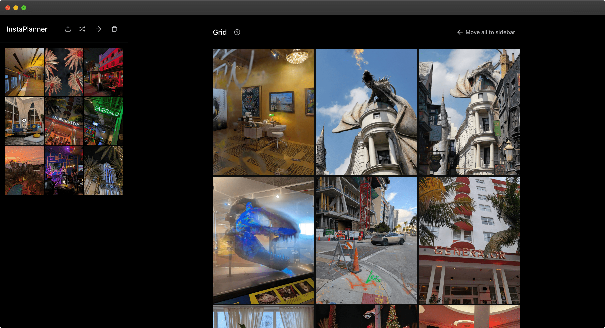

# InstaPlanner

InstaPlanner is a modern, responsive web application for organizing and planning Instagram posts. It provides an intuitive drag-and-drop interface, keyboard shortcuts, and a flexible layout system for efficient content management.



## Features

- 📱 Responsive design that works on desktop and mobile
- 🖼️ Drag and drop image organization
- ⌨️ Keyboard shortcuts for power users
- 📂 Local storage with IndexedDB
- 🔄 Undo/redo functionality
- 🎯 Context menus for quick actions
- 🌓 Dark mode optimized
- ⚡ Built with performance in mind
- 🧪 Comprehensive test coverage
- 📝 TypeScript for type safety

## Tech Stack

- Next.js 14
- TypeScript
- Tailwind CSS
- shadcn/ui
- Framer Motion
- dnd-kit
- IndexedDB
- Vitest
- Testing Library

## Getting Started

### Prerequisites

- Node.js 18.18.0 or higher
- npm or yarn

### Installation

1. Clone the repository:

```bash
git clone https://github.com/yourusername/instaplanner.git
cd instaplanner
```
